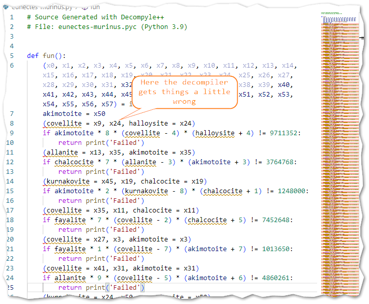

# HSCTF 9

## reversing/eunectes-murinus


In this challenge we are provided with a file named eunectes-murinus.pyc which is a compiled python module

My first attempt to decompile the .pyc-file was with  [decompyle3](https://github.com/rocky/python-decompile3) which didn't work because the .pyc-file was compiled with Python 3.9 which decompyle3 doesn't support.


Next I tried another newer decompiler called [Decompyle++](https://github.com/zrax/pycdc) which didn't shy away from Python 3.9 but seemed to get a little tripped up.



So I decided to look at the bytecode instead.

I created a small script where I imported the pyc-file. Python does not like dashes in the module names to I renamed the file to **chall.pyc**


This outputs some nice text for the byte code.


Here we can see the values used used in the if-statement we saw in the code generated by Decompyle++

```python
if akimotoite * 8 * (covellite - 4) * (halloysite + 4) != 9711352:
    return print('Failed')
```

So if we can figure out what the values should be to get all those if-statements to not pass we should be be able to solve it.

I've been wanting to try the [Z3 solver]() for some time and this seemed to be a good candidate for solving these statements.

To install z3-solver:

```bash
   pip3 install z3-solver
```

A basic program using the Z3 solver can look something like this, where you register some variables and some statements and then run the solver.
The **check()** function runs the solver, and the **model()** returns the model with the solution.

```python
x = Int('x')
y = Int('y')

s = Solver()
s.add(x > 1, y > 1, x + y > 3, z - x < 10)
print(s.check())
m = s.model()
print(m)
```

All the if-statements follow the same pattern, but looking the number of rows in the decompiled file we can determine that there are about a 100 such statements.
Way too many to write manually.

I wrote a python program to extract the values and generate another python program with the Z3 statements.

```python
f = open('bytecode.txt','rb')

def skip(x):
    for _ in range(x):
        f.readline()

def skip_to_blank():
    while True:
        line = f.readline()
        if line == b'\n':
            return

skip(65)

print('from z3 import *')

for x in range(0,58):
    print(f"x{x} = Int('x{x}')")

print('s = Solver()')

while True:
    p1 = int(f.readline()[40:42])
    skip(2)
    p2 = int(f.readline()[40:42])
    skip(2)
    p3 = int(f.readline()[40:42])
    skip(2+3+1)
    v1 = int(f.readline()[44:-2])
    skip(2)
    v2 = int(f.readline()[44:-2])
    skip(3)
    v3 = int(f.readline()[44:-2])
    skip(2)
    a = int(f.readline()[44:-2])
    skip_to_blank()
    #pyrophanite * 8 * (covellite - 3) * (akimotoite + 4) != 9270480

    print(f"s.add(x{p1} * {v1} * (x{p2} - {v2}) * (x{p3} + {v3}) == {a})")
    if a == 9270480:
        break
    
print(f'''
print(s.check())
m = s.model()
flag = ""''')

for x in range(58):
    print(f'flag += chr(m.eval(x{x}).as_long())')
print('print(flag)')
```

the generated program looked something like this: (I've remove some of the generated code and added some lines for readability)

```python
from z3 import *

x0 = Int('x0')
x1 = Int('x1')
...
x56 = Int('x56')
x57 = Int('x57')

s = Solver()

s.add(x0>=0, x0<=255)
s.add(x1>=0, x1<=255)
...
s.add(x56>=0, x56<=255)
s.add(x57>=0, x57<=255)

s.add(x50 * 8 * (x9 - 4) * (x24 + 4) == 9711352)
s.add(x54 * 7 * (x13 - 3) * (x35 + 3) == 3764768)
s.add(x57 * 2 * (x45 - 8) * (x19 + 1) == 1248000)
...
s.add(x55 * 9 * (x43 - 9) * (x19 + 3) == 10577952)
s.add(x56 * 4 * (x48 - 5) * (x10 + 9) == 2099160)
s.add(x12 * 8 * (x32 - 3) * (x18 + 4) == 9270480)

print(s.check())
m = s.model()
flag = ""
flag += chr(m.eval(x0).as_long())
flag += chr(m.eval(x1).as_long())
...
flag += chr(m.eval(x56).as_long())
flag += chr(m.eval(x57).as_long())
print(flag)
```

The first time I tried it actually didn't seem so complete, so after waiting about 10 minutes i started thinking. I figured that it might be a good idea to contrain the range in which the values of the variables could be. So I added the code below.

```python
for x in range(0,58):
    print(f"s.add(x{x}>=0, x{x}<=255)")
```

Now it solves it in about a second.


This was a very satisfying challenge. Thanks "hmmm" and HSCTF!
